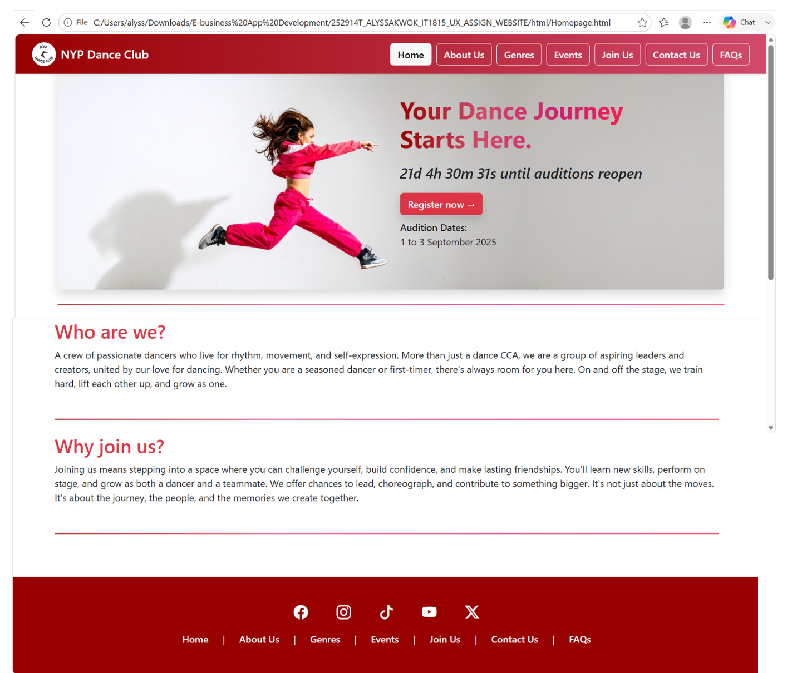
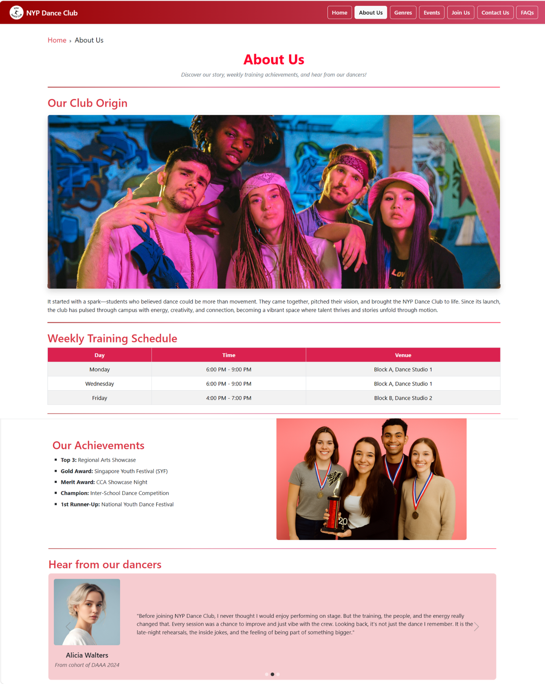
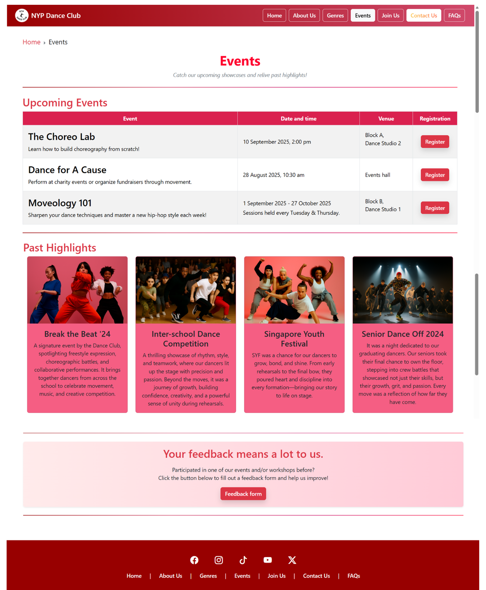

# NYP-Dance-Club-Website
A multi-page website developed as a group project for the UX Design module at Nanyang Polytechnic. The website was designed to promote the NYP Dance Club by providing prospective members with information about the club, upcoming events, membership, and contact details through an intuitive and visually engaging user experience.

## Website Preview

### Homepage 

### About Us Page

### Events Page

## My Contributions
- Developed the **Homepage** with a prominent call-to-action to encourage club sign-ups and clearly communicate the club's purpose.

- Designed the **About Us** page by implementing a testimonial carousel and achievement showcase to strengthen the club's credibility.

- Built the **Events** page using Bootstrap cards and structured event tables to present past and upcoming events in a visually engaging and organised manner.

## Technologies Used
- HTML

- CSS

- Bootstrap 5

- JavaScript

## Key Features
- Responsive multi-page website optimised for desktop and mobile devices.

- Consistent colour palette and vibrant imagery that reflect the NYP Dance Club's energetic identity.

- User-centred design incorporating UX principles such as breadcrumbs and interactive elements to improve navigation and usability.

- Clear content organisation with dedicated pages for the club, events, membership, and contact information.

## Project Type
Academic Group Project

> This repository showcases my individual contributions to the project. Features developed by other team members are not listed above.
